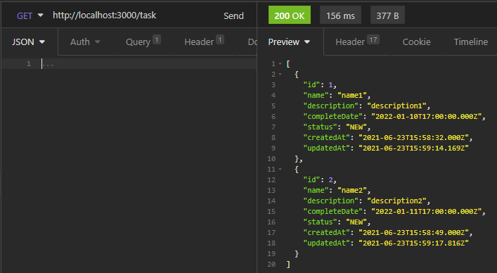

# Table of content
* [Giới thiệu](#Giới-thiệu)
* [Cấu trúc cây](#Cấu-trúc-cây)
* [Mô hình cơ sở dữ liệu](#Mô-hình-cơ-sở-dữ-liệu)
* [Luồng request](#Luồng-request)
* [Điều kiện tiên quyết](#Điều-kiện-tiên-quyết)
* [Cách cài đặt](#Cách-cài-đặt)
* [Cách sử dụng](#Cách-sử-dụng)
	* [Hướng dẫn sử dụng ứng dụng bằng Insomnia](#Hướng-dẫn-sử-dụng-ứng-dụng-bằng-Insomnia)
		* [Sign Up](#Sign-Up)
		* [Sign In](#Sign-In)
		* [Add To-Do](#Add-To-Do)
		* [Update To-Do](#Update-To-Do)
		* [Remove To-Do](#Remove-To-Do)
		* [Get All To-Do](#Get-All-To-Do)
		* [Get To-Do By Id](#Get-To-Do-By-Id)
		* [Get All User](#Get-All-User)
		* [Assign To-Do](#Assign-To-Do)
* [Thông tin liên lạc](#Thông-tin-liên-lạc)

## Giới thiệu
Ứng dụng quản lý danh sách công việc cần làm, được viết bằng JavaScript.

## Cấu trúc cây
<p align="left">
	
</p>

## Mô hình cơ sở dữ liệu
<p align="left">
	
</p>

## Luồng request
<p align="left">
	
</p>

## Điều kiện tiên quyết
Đã cài đặt nodejs <https://nodejs.org/en/download/>

Đã cài đặt thư viện ts-node
```console
$ npm i ts-node -g
```
Cài đặt thư viện typeorm
```console
$ npm i typeorm -g
```

## Cách cài đặt
* **Bước 1**: Cài đặt những thư viện cần thiết cho dự án
```console
$ npm install
```
* **Bước 2**: Thiết lặp cài đặt cơ sở dữ liệu trong file `./ormconfig.json`
* **Bước 3**: Thiết lặp cài đặt thông tin khác trong file `./src/config/config.ts`
* **Bước 4**: Khởi chạy dự án và tạo những bảng được định nghĩa vào cơ sở dữ liệu (nếu chưa có trong cơ sở dữ liệu)
```console
$ npm start
```
* **Bước 5**: Tạo dữ liệu mẫu `mật khẩu mặc định của user là: Aa@123456`
```console
$ ts-node --transpile-only ./node_modules/typeorm/cli.js migration:run
```
* **Bước 6**: Bạn phải thực hiện lại bước 4 nếu bạn đã dừng server.

## Cách sử dụng
### Hướng dẫn sử dụng ứng dụng bằng Insomnia
Cài đặt Insomnia <https://insomnia.rest/download]>
#### Sign Up
`Route (POST) /auth/signUp`
<p align="left">
	
</p>

#### Sign In
`Route (POST) /auth/signIn`
<p align="left">
	
</p>
Hệ thống sẽ trả về biến auth trong Header
<p align="left">
	
</p>

#### Add To-Do
`Route (POST) /task`
Thêm biến auth vào Header trong những route tiếp theo
Chú ý: Nếu dùng bằng browser, bạn không phải thực hiện bước mày mà hệ thống sẽ tự động ghi vào browser.
<p align="left">
	
</p>
Tiếp tục
<p align="left">
	
</p>

#### Update To-Do
`Route (PATCH) /task/:id`
<p align="left">
	
</p>

#### Remove To-Do
`Route (DELETE) /task/:id`
<p align="left">
	
</p>

#### Get All To-Do
`Route (GET) /task`
<p align="left">
	
</p>

#### Get To-Do By Id
`Route (GET) /task/:id`
<p align="left">
	
</p>

#### Get All User
`Route (GET) /user`
<p align="left">
	
</p>

#### Assign To-Do
`Route (PATCH) /assign/:id`
<p align="left">
	
</p>

## Thông tin liên lạc
Nếu có bất kì thắc mắc gì, vui lòng liên hệ một trong những địa chỉ email sau:
* **Hải Trần** &lt;tranvietthanhhaiit@gmail.com&gt;
* **Hải Trần** &lt;haitran23031999@gmail.com&gt;
